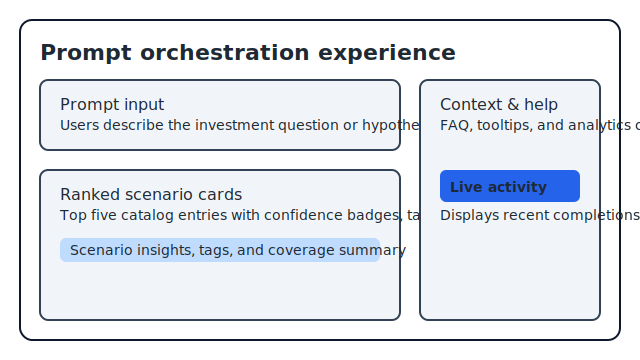
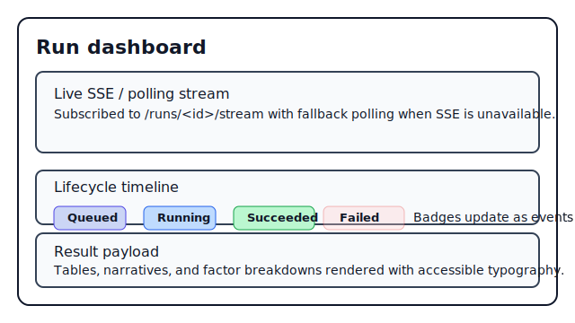

# Market Magic — Multi-Modal Financial Market Prediction

A production-minded scaffold for a **multi-modal financial market prediction**
assistant. Users express an investment goal in natural language, receive ranked
analysis scenarios (factor screens, trend diagnostics, earnings momentum, etc.),
and can launch detailed analytics runs from the same flow. Under the hood the
platform continues to orchestrate data- and model-driven pipelines (pricing,
fundamentals, text sentiment, macro signals) so the prompt-first UX remains
grounded in quantitative multi-modal insights. The codebase still ships with
legacy single-ticker prediction utilities for comparison.

Live GitHub Pages deployment: https://<your-github-username>.github.io/Enterprize_MM/

> This is a *starter* repo: services run locally via `docker compose` and are
> structured for gradual hardening. Replace placeholders marked with `TODO:`
> when wiring real data, LLM providers, and persistence layers.

## Fast Start

```bash
make bootstrap        # install pre-commit hooks + copy env templates
make up               # launch Postgres, Kafka, MLflow, API, orchestrator, etc.
make orchestrator     # iterate on orchestration service (rebuilds and restarts only that container)
make api              # rebuild/restart the FastAPI gateway if you touch /analysis routes
make seed             # load base schema and seed data

cd frontend
npm install
NEXT_PUBLIC_API_BASE_URL=http://localhost:8000 npm run dev  # http://localhost:3000
```

## Prompt Workflow Demo

```bash
curl -s http://localhost:8000/analysis/suggest \
  -H "Content-Type: application/json" \
  -d '{"prompt": "Find a quality dividend compounder", "max_scenarios": 5}' | jq

curl -s http://localhost:8000/analysis/run \
  -H "Content-Type: application/json" \
  -d '{"scenario_id": "trend_strength", "parameters": {"universe": ["AAPL","MSFT","GOOG"]}}' | jq

# Follow the orchestrator's SSE feed for a run
curl -N http://localhost:8000/analysis/runs/<run_id>/stream
```

## Frontend Walkthrough

The refreshed Next.js UI collects prompts, highlights the top five ranked
scenarios, and opens real-time dashboards for each run. Tooltips and an FAQ
section explain how ranking works, while prompt submissions are logged through a
lightweight analytics endpoint.





## High-Level Architecture

- **services/api** – FastAPI gateway exposing `/analysis/suggest`, `/analysis/run`, and legacy `/predict`.
- **services/orchestration** – Ranks the 12-scenario catalog, stubs LLM metadata, schedules executions.
- **services/modeling** – Scenario registry with concrete quant factor, trend/RS, and earnings modules plus placeholders.
- **services/ingestion** – Prefect flows for OHLCV, fundamentals, macro, sentiment (deterministic stubs).
- **services/serving** – MLflow-backed legacy prediction service.
- **frontend/** – Next.js front-end with prompt capture, ranked scenarios, run dashboards, analytics logging, and accessibility helpers.
- **docs/** – Architecture + developer guides reflecting the prompt-first, multi-modal flow.

See `docs/ARCHITECTURE.md` and `docs/DEVELOPER_GUIDE.md` for deeper detail.

## TODO Highlights

- Integrate a production LLM provider for richer prompt understanding.
- Persist orchestration run metadata (Postgres/Redis) beyond the current in-memory store.
- Replace synthetic data generators with vendor feeds and connect scenario modules.
- Expand scenario implementations and automate regression checks across the catalogue.
- Wire the analytics endpoint to a persistent warehouse / product analytics stack.
