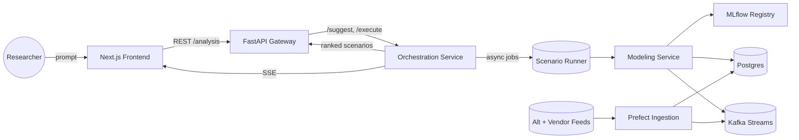
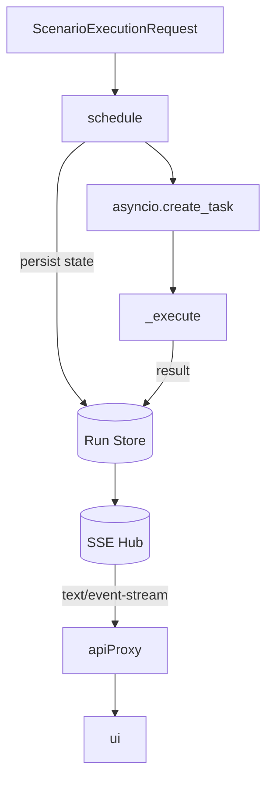
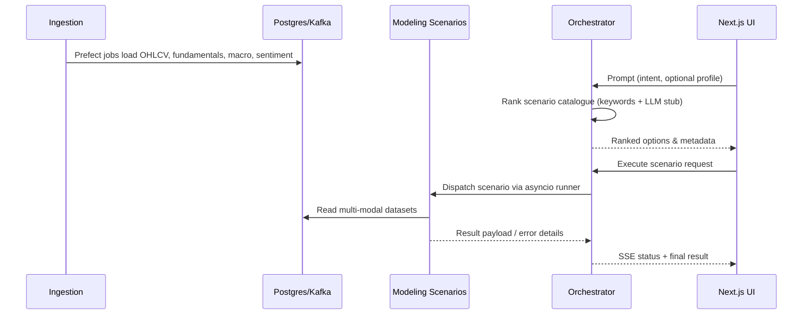

# Architecture Overview

## System Context

The platform centres on a **prompt-driven orchestration layer** that curates a
catalogue of analytics scenarios and streams run progress back to the user
interface. Legacy prediction endpoints remain available, but all new workflows
enter through the `/analysis` API exposed by the FastAPI gateway.

- **Frontend (Next.js)** gathers the prompt, renders ranked scenario cards, and
  opens live run dashboards using Server-Sent Events (SSE) to follow job
  progress.
- **API Gateway (`services/api`)** validates incoming requests, enforces
  rate limits, and proxies traffic to the orchestration service.
- **Orchestration (`services/orchestration`)** owns the scenario catalogue,
  performs deterministic keyword ranking backed by an LLM prompt stub, schedules
  modeling jobs, and publishes lifecycle updates via SSE.
- **Modeling (`services/modeling`)** contains the concrete scenario
  implementations (quant factors, trend strength, earnings momentum, etc.) that
  the orchestrator dispatches.
- **Ingestion (`services/ingestion`)** loads market, fundamental, macro, and
  sentiment data into Postgres/Kafka so scenario modules can blend modalities.
- **Serving (`services/serving`)** continues to expose the MLflow-backed
  `/predict` endpoint for backwards compatibility.

## Scenario Catalogue & Ranking

The orchestration service keeps an authoritative scenario catalogue
(`app/catalog.py`). Each entry describes:

- `scenario_id` and human friendly title/description.
- Key **inputs** (tickers, universes, horizons) and methodological notes.
- Expected **deliverables** (factor ladders, watchlists, narrative summaries).
- Keyword metadata that powers the deterministic scorer today and seeds the LLM
  reranker when a provider is connected.

When a prompt arrives, the ranking module tokenises it, applies keyword
frequency/affinity scoring, and returns the top `MAX_SCENARIOS` options. The
response embeds lightweight LLM metadata (`PromptEngine`) so the UI can surface
model provenance even while the provider is stubbed locally.

## Orchestration Runtime & Streaming

- Each execution receives a UUID and an initial `queued` state persisted in an
  in-memory store. When the background worker takes ownership it emits a
  `running` update, and every transition is broadcast to any SSE subscribers.
- The asynchronous runner imports the modeling scenario, executes it on a
  background thread, and writes either `succeeded` (with payload) or `failed`
  (with error context) back to the store.
- Subscribers consume Server-Sent Events via `/runs/{id}/stream`. The API
  gateway proxies this stream so browsers can connect without hitting the
  internal service directly.
- Multiple subscribers can observe the same run concurrently thanks to an
  asyncio-based publish/subscribe fan-out.

Future hardening (see TODOs) includes persisting run metadata in Postgres/Redis,
plugging in a production LLM, and extending retries/backoff across scenario
executions.

## End-to-End Job Lifecycle

1. **Prompt Submission** – The Next.js landing page posts the user's prompt to
   `/analysis/suggest`, displays the top five ranked scenarios, and logs prompt
   analytics through the frontend's `/api/analytics` endpoint.
2. **Scenario Selection** – Choosing a scenario triggers `/analysis/run`, which
   schedules the job inside the orchestration service and returns a `run_id`.
3. **Run Dashboard** – The UI navigates to `/runs/{run_id}` and opens an SSE
   stream (or polling fallback). Initial `queued` state is shown immediately
   while the modeling engine spins up.
4. **Model Execution** – Scenario code reads from Postgres/Kafka (deterministic
   stubs locally) and generates factor scores, watchlists, or textual summaries.
5. **Streaming Updates** – State changes (`queued` → `running` →
   `succeeded`/`failed`) are
   emitted over SSE and rendered in the dashboard timeline.
6. **Result Delivery** – Once complete, the modeling payload is displayed and
   persisted (planned) for follow-up workflows such as report generation or
   alerts.

## Data & Analytics Flow

This flow keeps the orchestration layer thin: it selects, schedules, and tracks
work while the modeling service performs the heavy data lifting. As additional
scenarios are added, they register with the catalog and share the same lifecycle.
